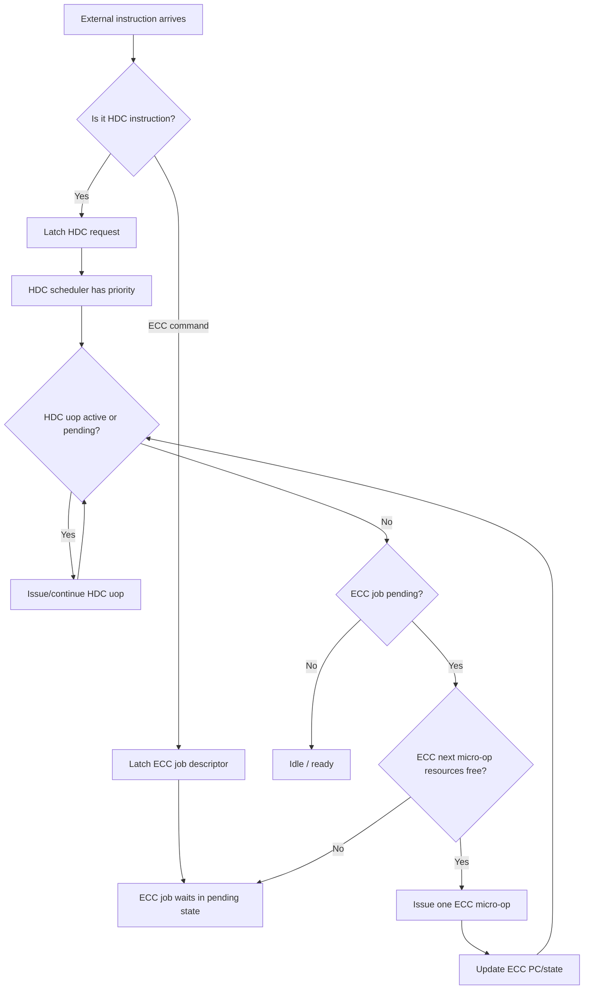
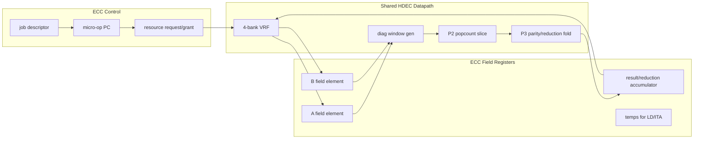
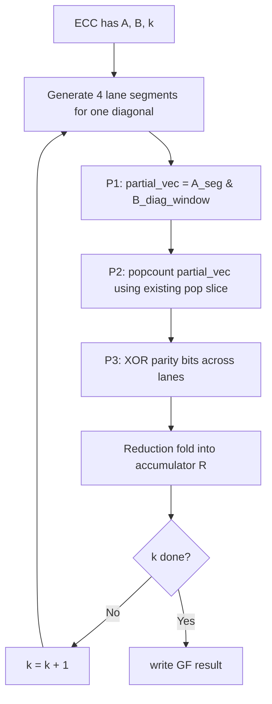

# HDEC ECC Implementation Prep: Diagonal GF(2) Multiplication

Date: 2026-06-09
Base branch: `hdec-p2-popcount-p3accum-v1`
Base commit: `07bd8cbd hdec: split P2 popcount with P3 accumulation`
Prep branch: `hdec-ecc-implementation-prep`

## 1. Short Conclusion

用户提出的斜线加法思想，在数学本体上等价于 GF(2) 多项式乘法的经典卷积系数：

```text
c[k] = XOR over all i+j=k of (a[i] & b[j])
```

这件事本身已经是 polynomial-basis GF(2^m) 乘法、Mastrovito multiplier、bit-parallel multiplier、Toeplitz/matrix-vector multiplier 等方向的基础。也就是说，“斜线上的部分积做无进位加法/异或归约”不是全新的数学公式。

可能形成 HDEC 独立创新点的是：

1. 把斜线归约映射成 HDC 已有的 popcount/parity 计算形状。
2. 不新增完整 ECC 乘法器，而是用 HDC 空闲的 lane/popcount/VRF 资源做 ECC 微操作。
3. 设计 HDC 优先、ECC 见缝插针的同周期资源仲裁与可暂停微调度。
4. 比较 1 条斜线、4 条斜线、更多条斜线并行时的面积/时序/吞吐权衡。

所以论文表述上建议避免说“首次发现斜线公式”，而应强调：

```text
HDC-popcount-aware GF(2) diagonal multiplication and opportunistic ECC/HDC pipeline reuse.
```

## 2. Literature Check

### 2.1 What is already known

GF(2^m) polynomial basis multiplication通常分为两步：先做 GF(2)[x] 多项式乘法，再按不可约多项式约减。经典乘法中第 k 个原始乘积系数就是所有 `i+j=k` 的 `a[i]b[j]` 的 GF(2) 求和。这个形式在 bit-parallel GF multiplier survey 中以 coefficient/convolution 形式出现。

Mastrovito multiplier 把 GF(2^m) 乘法写成矩阵乘法，并针对不可约多项式构造 product matrix。Zhang 和 Parhi 的工作明确讨论了 Mastrovito product matrix 的系统构造与 VLSI 模块化实现。

在硬件层面，GF(2) 多项式乘法与普通二进制乘法的区别是：同权重部分积相加时不产生进位，而是 XOR。Justia 收录的 polynomial/natural combined multiplier 专利也明确描述了“same degree partial products are added by XOR/no carry”这一硬件事实。

### 2.2 What I did not find in this quick pass

本轮检索不是穷尽式论文/专利查新，但没有找到一篇直接把该斜线归约称为“popcount-based HDC reuse”的论文，也没有看到把 HDC hyperdimensional computing 的 popcount datapath 作为 ECC GF(2^m) 乘法器复用资源的明确实现。

因此，比较谨慎的判断是：

```text
斜线/卷积/异或归约是已有经典理论；
用 HDEC/HDC 的 popcount 数据通路和空闲周期调度来承载 ECC，是更可能有新意的地方。
```

### 2.3 Useful references

- Survey of bit-parallel GF(2^n) multipliers:
  https://www.sciencedirect.com/science/article/pii/S107157971400121X
- Zhang and Parhi, systematic Mastrovito multiplier design:
  https://experts.umn.edu/en/publications/systematic-design-of-original-and-modified-mastrovito-multipliers/
- Polynomial and natural multiplier architecture patent, useful for no-carry/XOR partial-product explanation:
  https://patents.justia.com/patent/7266579
- ECC processor background over GF(2^m), LD/Montgomery context:
  https://www.mdpi.com/2079-9292/12/19/4110
- Recent FPGA GF(2^m) multiplier direction, useful as a comparison target:
  https://arxiv.org/abs/2506.09464
- Low-complexity bit-parallel GF(2^m) multiplier reference:
  https://eprint.iacr.org/2012/414.pdf

## 3. Existing HDEC Reuse Points

Current HDEC shape:

- 4 lanes.
- Each lane is 64-bit.
- One VRF index stores 256 bits as 4 banks x 64 bits.
- One HDC hypervector is 1024 bits, stored as 4 VRF indices.
- Current P2 pop slice computes `XOR + two 32-bit popcount partials`.
- Current HSIM/HMATCH path is:
  - P2: lane-local partial popcount.
  - P3_GLOBAL: sum lane partials into `group_dist_q`.
  - P3_ACCUM: update HSIM/HMATCH state.

For ECC, this is almost perfect for a 256-bit binary-field element:

```text
GF(2^m) element, m <= 256
  -> stored in one VRF index
  -> bank0 = bits [63:0]
  -> bank1 = bits [127:64]
  -> bank2 = bits [191:128]
  -> bank3 = bits [255:192]
```

This means ECC field elements can share the current VRF naturally.

## 4. Diagonal Multiplication Model

For field elements:

```text
A(x) = sum a[i] x^i
B(x) = sum b[j] x^j
P(x) = A(x) * B(x)
```

Raw product coefficient:

```text
p[k] = parity( number of ones among all a[i] & b[j], where i+j=k )
     = XOR over all i+j=k of (a[i] & b[j])
```

Important correction:

```text
For ECC we only need parity, not full popcount count.
```

But HDEC already has popcount hardware. Therefore:

```text
parity = popcount[0]
```

For current split popcount:

```text
lane_parity = popcount_part_q_o[0][0] ^ popcount_part_q_o[1][0]
```

Across 4 lanes:

```text
diag_parity = lane0_parity ^ lane1_parity ^ lane2_parity ^ lane3_parity
```

## 5. First ECC Multiply Datapath

The safest reuse path is not to add AND mode directly inside `hdec_p2_pop_slice`.

Instead:

1. ECC P1 builds a 64-bit partial-product vector:

```text
partial_vec = A_segment & B_reversed_diagonal_window
```

2. Reuse existing pop slice unchanged by feeding:

```text
src_a_i = partial_vec
src_b_i = 64'b0
```

3. Existing XOR path sees:

```text
partial_vec ^ 0 = partial_vec
```

4. P2 popcount produces count partials.
5. ECC P3 uses only parity bits.

This avoids placing a new 64-bit XOR/AND mode mux on the current HDC P2 critical path.

## 6. Diagonal Window Generation

For one diagonal k, one 64-bit segment starts at `i_base`.

```text
for t in 0..63:
    a_bit = A[i_base + t]
    b_bit = B[k - (i_base + t)]
    partial_vec[t] = a_bit & b_bit
```

The hard part is `B[k-i]`, because it is reversed relative to A.

Therefore ECC needs a small `ecc_diag_window_gen`:

```text
Inputs:
  A[255:0]
  B[255:0]
  k
  i_base

Output:
  a_seg[63:0]
  b_diag_window[63:0]
```

Then:

```text
partial_vec = a_seg & b_diag_window
```

The window generator is control-heavy, not arithmetic-heavy. It should be added outside the HDC pop slice first. Later OOC will decide whether to:

- keep it as a small ECC-only helper,
- share HPERM shift-align,
- precompute reversed B copies in VRF,
- or store B in both normal and reversed layout.

## 7. Multi-Diagonal Parallelism Options

### Mode A: 1 diagonal, 4 lane segments

One product bit k is computed by splitting the diagonal across up to four 64-bit segments.

```text
lane0: segment 0
lane1: segment 1
lane2: segment 2
lane3: segment 3
```

Pros:

- minimal control complexity.
- one full diagonal can be completed in one ECC P2/P3 group for m <= 256.
- easy first correctness target.

Cons:

- only one product bit per ECC group.
- raw multiply needs up to `2m-1` product bits.

For m=256:

```text
511 product bits -> about 511 ECC groups before reduction folding.
```

### Mode B: 4 diagonals in parallel

Each lane computes one different diagonal.

```text
lane0: k
lane1: k+1
lane2: k+2
lane3: k+3
```

Pros:

- up to 4x diagonal throughput.
- better use of 4 lanes.

Cons:

- each lane needs a different B reversed window.
- P3 must write four product bits or fold four reduction contributions.
- more ECC control registers.

This should be the second milestone, not the first.

### Mode C: 8 diagonals using current 2x32 partials

Current pop slice internally gives two 32-bit counts per lane. In theory, each 32-bit half could serve a different diagonal.

Pros:

- up to 8 diagonal partials per cycle.

Cons:

- window generation becomes much harder.
- P2 source alignment becomes complicated.
- likely increases mux/control fanout and risks timing.

This is a research branch only after Mode B is understood.

## 8. Reduction Strategy

Avoid storing a full 511-bit raw product if possible.

Preferred first implementation:

```text
on-the-fly modular reduction
```

When a product bit `p[k]` is produced:

- if `k < m`, XOR into result bit `k`.
- if `k >= m`, fold according to irreducible polynomial.

Example for a trinomial:

```text
f(x) = x^m + x^r + 1
x^m = x^r + 1
```

Then high bit `p[k]` folds to:

```text
result[k-m] ^= p[k]
result[k-m+r] ^= p[k]
```

For pentanomial:

```text
f(x) = x^m + x^a + x^b + x^c + 1
```

High bit folds into four target positions.

Open decision:

- If we target standard binary ECC curves, use `m=233` or `m=283` with their known reduction polynomials.
- If we target HDEC-native `GF(2^256)`, we need a chosen irreducible polynomial and curve security story.

For digital signature compatibility, standard binary curves are easier to justify. For HDEC datapath fit, `m <= 256` is natural.

## 9. HDC/ECC Resource Arbitration

User requirement:

```text
HDC has priority.
ECC runs sequentially.
When ECC needs a resource:
  if HDC is using it, ECC waits;
  if HDC is not using it, ECC uses it;
  if HDC becomes ready to use it, ECC yields at the next micro-op boundary.
```

Important hardware refinement:

ECC cannot safely "exit in the middle of a clock edge." It should yield only at micro-op boundaries.

Therefore:

```text
ECC grant is decided before issuing each ECC micro-op.
Once an ECC micro-op is issued, it owns the resource for that cycle/stage.
HDC can preempt before the next ECC micro-op.
```

## 10. Proposed Arbiter Flow



## 11. Resource Classes

The arbiter should not be one monolithic busy bit. Use resource classes:

| Resource | HDC users | ECC use |
|---|---|---|
| VRF read address/data | HDC P1_RD0/P1_RD1, direct counter/clip reads | load A/B limbs, maybe load/write ECC temp |
| VRF write | HBIND, HCNTADD, HCLR, HCNTCLR, HCNTCLIP, VWR64 | store ECC field temps/result |
| P2 XOR/popcount slice | HBIND/HSIM/HMATCH | diagonal partial parity |
| P3 global reduction | HSIM/HMATCH group_dist | diagonal parity combine/reduction fold |
| lane shift/perm | HPERM | optional B window generation |
| scalar response | HDC responses | ECC done/status |

Initial rule:

```text
If HDC state is not S_IDLE/S_RESULT, ECC only uses resources not claimed by that HDC state.
If a new HDC instruction is accepted, ECC stops issuing new micro-ops immediately.
```

Because current `hdec_top` is a single FSM, the first implementation should not attempt true simultaneous HDC/ECC execution everywhere. It should first expose per-stage resource-valid signals and then gradually allow overlap.

## 12. ECC Microarchitecture



## 13. ECC Operation Stack

### Level 0: GF(2) primitive operations

- field add: XOR.
- field square: bit interleave + reduction, or precomputed linear map.
- field multiply: diagonal parity + reduction.
- field inverse: Itoh-Tsujii algorithm.

### Level 1: point operations

Use Lopez-Dahab/Montgomery ladder for binary fields:

- scalar multiplication has a regular sequence.
- projective coordinates reduce inversion frequency.
- final affine conversion uses inversion.

### Level 2: signature activity

The core should accelerate field/scalar operations. Full digital signature also needs:

- hash input.
- nonce/scalar handling.
- modular arithmetic over group order n.
- protocol-level state.

Recommendation:

```text
First hardware milestone should be GF(2^m) multiply/square/add/invert acceleration,
not full ECDSA in one step.
```

## 14. Implementation Milestones

### Milestone 0: documentation and test model

No RTL functional change.

Deliverables:

- this plan.
- Python reference model for diagonal GF(2) multiply and reduction.
- test vectors for small m: 8, 16, 32.
- later test vectors for target m: 233 or 256.

### Milestone 1: ECC-only reference micro-op, no HDC overlap

Add ECC opcodes/status but do not overlap with HDC yet.

Goal:

```text
ECC multiply works when HDEC is otherwise idle.
```

RTL additions:

- `HDEC_ECC_START` / `HDEC_ECC_STATUS` reserved instruction encoding.
- `ecc_state_q`, `ecc_pc_q`, `ecc_busy_q`.
- ECC field registers or ECC VRF address convention.
- `ecc_diag_window_gen`.
- reuse pop slice by feeding partial vector and zero.

Validation:

- Vivado simulation for small GF(2^m) multiply.
- OOC timing at 200 MHz.

### Milestone 2: one diagonal per ECC group

Compute one raw product/reduction bit per group.

Flow:



Expected:

- minimum new logic.
- easiest debug.
- slower but proves architecture.

### Milestone 3: four diagonals per ECC group

Use lanes as diagonal-parallel workers:

```text
lane0 -> k
lane1 -> k+1
lane2 -> k+2
lane3 -> k+3
```

Expected:

- about 4x diagonal throughput over Milestone 2 for the multiplication core.
- increased window generator/mux logic.
- P3 fold writes four reduction bits.

This is the first meaningful performance version.

### Milestone 4: opportunistic HDC/ECC overlap

Expose HDC resource usage:

```text
hdc_uses_vrf_r
hdc_uses_vrf_w
hdc_uses_pop
hdc_uses_p3
hdc_accepting_new_cmd
```

ECC micro-op declares:

```text
ecc_needs_vrf_r
ecc_needs_vrf_w
ecc_needs_pop
ecc_needs_p3
```

Grant:

```text
ecc_grant = ecc_pending && !conflict && !hdc_new_cmd_pending
```

ECC only advances on `ecc_grant`.

### Milestone 5: LD + ITA macrosequence

Build a microcode ROM/table for:

- GF multiply.
- GF square/reduce.
- Itoh-Tsujii inversion.
- Lopez-Dahab Montgomery ladder scalar multiplication.

Keep the first target constant-time:

```text
same operation count independent of scalar bits.
```

## 15. Expected Cost and Performance Trend

Very rough expectations before RTL:

| Version | Throughput | LUT increase | FF increase | Risk |
|---|---:|---:|---:|---|
| one diagonal, 4 lane segments | 1 product bit/group | +200 to +500 | +100 to +250 | low |
| 4 diagonals parallel | 4 product bits/group | +500 to +1200 | +200 to +500 | medium |
| 8 half-lane diagonals | up to 8 product bits/group | +1000+ | +400+ | high |
| dedicated XOR parity tree instead of popcount reuse | faster/lower LUT for ECC alone | +area outside HDC | +regs | medium |

Important:

```text
Using existing popcount hardware is area-efficient only if it is truly reused.
If we instantiate a new ECC popcount tree, parity XOR is cheaper than full popcount.
```

## 16. Open Technical Questions

1. Target field:
   - standard binary curve, e.g. m=233?
   - HDEC-native m=256?
2. Irreducible polynomial:
   - trinomial/pentanomial determines reduction cost.
3. Storage layout:
   - one VRF entry per field element is natural.
   - do we store B reversed to simplify diagonal windows?
4. Parallelism:
   - start with one diagonal.
   - then 4 diagonals.
5. Security:
   - scalar multiplication should be constant-time.
   - ECC background scheduling must not leak scalar-dependent timing through HDC-visible stalls.
6. Interface:
   - HDEC custom instruction starts ECC job.
   - software polls status or gets interrupt later.
7. Verification:
   - first small-m model.
   - then target curve known test vectors.

## 17. Recommended Next Step

Do not start by adding full ECC.

Start with:

```text
ECC diagonal multiplier reference model + RTL skeleton
```

Concrete next patch:

1. Add `docs/hdec/ecc/` reference notes and Python model.
2. Add SystemVerilog package constants for ECC field size and polynomial, guarded as experimental.
3. Add `ecc_diag_window_gen.sv` as a standalone module.
4. Add a tiny OOC target for `ecc_diag_window_gen` and a small simulation testbench.
5. Only after that, connect it to `hdec_top`.

This keeps HDEC's currently good P2/HMATCH timing intact while we prove the ECC idea in isolation.
