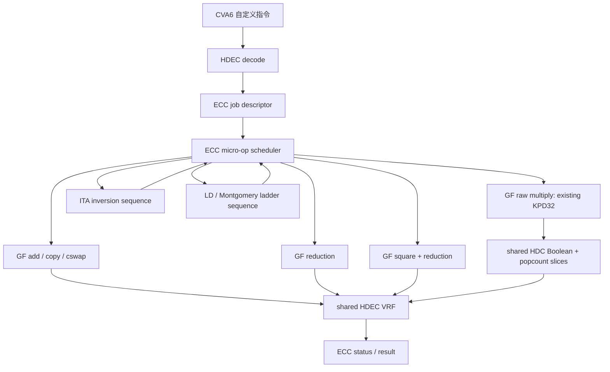

# HDEC ECC V11 标量点乘实现计划

日期：2026-06-10
基础分支：`hdec-ecc-kpd32-v10-ecc-increment-ppa`
V11 分支：`hdec-ecc-scalar-pointmul-v11`
范围：本提交只做计划，不修改 RTL。

## 1. 简短结论

V10 已经完成了最难的第一块核心算子：

```text
256-bit GF(2) 原始多项式乘法
  = Karatsuba 路径选择
  + 斜线部分积 parity
  + 复用 HDC lane / popcount 硬件
```

但是现在的 `HDEC_ECC_MUL` 输出的是 512-bit 原始多项式乘积，还不是 `GF(2^m)` 里的有限域乘法结果，更不是完整椭圆曲线标量点乘。

要完成 `Q = kP`，还需要补齐这些层：

1. 模约减：`512-bit product -> m-bit field element`
2. 模平方：`A^2 mod f(x)`
3. 模加：`A xor B`
4. 字段复制、交换、条件交换
5. ITA 求逆控制器
6. Lopez-Dahab / Montgomery ladder 点运算控制器
7. 标量 bit 循环和点坐标存储规范
8. `ECC_PMUL` 指令和状态接口
9. Python golden model 与 Vivado xsim 功能验证

V11 的核心原则是：

```text
不新增第二套 ECC 乘法器。
继续复用 HDC 的 VRF、lane Boolean、popcount slice、VRF 命令寄存边界。
只新增那些没法优雅复用的“小面积 ECC 线性逻辑”和“微调度控制”。
```

## 2. 当前 V10 硬件状态

| 项目 | 当前状态 |
|---|---|
| ECC 指令 | `HDEC_ECC_MUL`, `HDEC_ECC_STATUS` |
| ECC 数据宽度 | 256-bit 输入，512-bit 原始乘积 |
| ECC 存储 | VRF[56:63]，共 8 个 256-bit ECC 预留槽 |
| 主要复用资源 | 4 个 64-bit HDC lane / popcount slice |
| 当前 ECC 核心 | KPD32 Karatsuba + 斜线 parity |
| 当前结果 | GF(2)[x] 原始乘积，尚未模约减 |
| 当前最佳 PPA | 5030 LUT，4558 Logic LUT，472 LUTRAM，2015 FF，约 202.47 MHz，原始乘法 390 cycles |

## 3. 完成 `Q = kP` 还缺什么

### 3.1 有限域运算层

二元域 ECC 的点乘最终都落到 `GF(2^m)` 运算上。V10 只有原始乘法，所以还缺：

| 运算 | 是否需要 | V11 第一版建议 | 复用关系 |
|---|---:|---|---|
| `GF_ADD(A,B)` | 需要 | lane-wise XOR 后写回 256-bit slot | 复用 HDC Boolean/XOR |
| `GF_MUL_RAW(A,B)` | 已有 | V10 `HDEC_ECC_MUL` | 复用 HDC popcount |
| `GF_REDUCE(P512)` | 需要 | 针对固定稀疏多项式的 XOR fold | 小型 ECC 线性逻辑 |
| `GF_MUL(A,B)` | 需要 | `MUL_RAW + REDUCE` | 复用乘法，新增约减 |
| `GF_SQR(A)` | 需要 | 专门做线性平方 + 约减，不建议长期用 `A*A` | 小型 XOR/置换逻辑 |
| `GF_INV(A)` | 需要 | ITA 固定平方/乘法链 | 控制器复用 `MUL/SQR` |
| `GF_COPY/MOVE` | 需要 | VRF 读写复制 | 复用 VRF |
| `GF_CSWAP` | 需要 | constant-time XOR-mask swap | 复用 XOR，小量 mask 控制 |

最先要做的是 `GF_REDUCE`。没有模约减，512-bit 原始乘积就没法进入 Montgomery LD 和 ITA。

### 3.2 点运算层

标量点乘需要点加、倍点、最终仿射恢复。低面积路线是：

```text
二元域 Lopez-Dahab projective coordinates
  + Montgomery ladder 风格的规则控制
  + ITA 最终求逆
```

原因：

1. 避免每个 scalar bit 都做一次求逆
2. 大部分运算都是 multiply / square / xor，适合复用 HDEC
3. 控制序列规则，比较容易做 constant-time
4. 外层点运算可以写成 field micro-op 的固定小程序

## 4. 域大小和曲线选择

HDEC 一个 VRF entry 正好是 256 bit：

```text
1 VRF entry = 4 banks x 64 bits = 256 bits
```

所以 ECC 第一版最好选择 `m <= 256`。

| 选择 | 优点 | 风险 |
|---|---|---|
| `m = 233` | 有标准二元域曲线可参考，约减多项式稀疏 | 256-bit slot 会空 23 bit |
| `m = 255` | 接近 255-bit 表述，slot 利用率高 | 需要明确不可约多项式和曲线参数 |
| `m = 256` | 最贴合 HDEC 256-bit slot | 标准化故事较弱，需要非常谨慎选参数 |

我的建议：

```text
RTL 写成可参数化，但 V11 测试先固定一个 m <= 256 的稀疏约减多项式。
如果要强调标准 ECC 兼容，优先考虑 m=233。
如果要强调 HDEC 结构匹配，考虑 m=255 或 m=256，但参数选择要更严谨。
```

在真正写完整 RTL 前必须定下来：

1. `m`
2. 不可约多项式 `f(x)`
3. 曲线方程和常数
4. 输入点 `P` 的格式
5. 输出是 x-only，还是完整 `(x,y)`

## 5. V11 建议架构



V11 不应该把所有东西写进一个超大的 top-level FSM。应该分两层：

```text
外层：
    ECC_PMUL job
    scalar bit loop
    point operation sequence

内层：
    field micro-op issue
    ADD / MUL / RED / SQR / COPY / CSWAP
```

这样后面加入完整 ITA、Montgomery LD、更多 ECC 调度时，不会把 VRF 地址、写使能、popcount 选择控制重新拖成大扇出关键路径。

## 6. ECC 存储计划

当前预留：

```text
VRF[56:63] = 8 个 256-bit ECC slot
```

初始分配建议：

| Slot | 用途 |
|---:|---|
| 56 | `X1` 或输入/base x |
| 57 | `Z1` 或输入/base y |
| 58 | `X2` |
| 59 | `Z2` |
| 60 | `T0` |
| 61 | `T1` |
| 62 | `T2` |
| 63 | `T3` / output / status scratch |

风险：

```text
如果要输出完整 Q=(x,y)，再加上 ITA 求逆，中间活跃 field element 可能超过 8 个。
```

第一版先尽量压在 8 个 slot 内。如果确实不够，优先借用：

```text
VRF[48:55] = 当前 HDC scratch / future expansion
```

不建议一上来给 ECC 加很多 256-bit FF shadow register，因为那会让 ECC 专属 FF 面积快速上涨，不利于“复用”叙述。

## 7. 指令接口计划

建议保留现有指令，同时增加 field-level 调试指令，方便逐层验证：

| 指令 | 作用 |
|---|---|
| `HDEC_ECC_MUL` | 保留当前 raw multiply，或者作为 debug raw multiply |
| `HDEC_ECC_FMUL` | 有限域乘法：raw multiply + reduction |
| `HDEC_ECC_FADD` | 有限域加法/XOR debug |
| `HDEC_ECC_FSQR` | 有限域平方 debug |
| `HDEC_ECC_PMUL_START` | 启动完整 `Q=kP` 标量点乘 |
| `HDEC_ECC_STATUS` | busy/done/error/cycle counter |

Field-level 指令很重要，因为它们可以先证明每个数学积木正确，再组合成完整点乘。

## 8. Micro-op 层次

### Level 0：field micro-op

```text
FADD    dst = src0 xor src1
FCOPY   dst = src0
FCSWAP  if mask: swap slot A and slot B
FMULR   tmp512 = raw_mul(src0, src1)
FRED    dst = reduce(tmp512)
FMUL    dst = reduce(raw_mul(src0, src1))
FSQR    dst = reduce(square(src0))
```

### Level 1：ITA 求逆

```text
FINV dst = src^(-1)
```

用固定平方/乘法链实现，不根据数据改变控制流。

### Level 2：点运算

```text
PDBL     projective point doubling
PADD     differential point addition
CSWAP_P  constant-time point swap
```

### Level 3：标量点乘

```text
PMUL:
    初始化 ladder registers
    从 scalar MSB 到 LSB 循环
    constant-time conditional swap/select
    PDBL/PADD sequence
    最后 ITA inversion
    affine recovery
    写回 Q
```

## 9. 为什么不直接加专用 ECC 单元

专用 ECC datapath 肯定会更快，但会削弱主线故事：

```text
HDC 的硬件可以被二元域 ECC 复用。
```

所以 V11 的允许范围应该是：

```text
可以新增：
    reduction XOR fold
    square bit permutation / XOR
    microcode counter / PC
    status / cycle counter

不建议新增：
    第二套完整 multiplier
    第二套完整 popcount/parity datapath
    大量 256-bit FF register file
```

## 10. 面积和时序预期

粗略预期如下：

| 新增内容 | LUT 影响 | FF 影响 | 时序风险 | 说明 |
|---|---:|---:|---|---|
| field reduction | 低到中 | 低 | 低，按 64-bit word 分拍即可 | 主要是 XOR fold |
| field add/copy | 低 | 低 | 低 | 复用 lane/VRF |
| field square | 中 | 低到中 | 低，按 word staged | 比用 raw multiply 做平方快很多 |
| ITA controller | 低 | 中 | 低 | 主要是 micro-PC/counter |
| ladder controller | 中 | 中 | 中 | 要防止控制扇出拖慢 VRF |
| 扩展 VRF scratch | 增加 LUTRAM | 很少 FF | 低 | 比 FF shadow bank 更适合 |

V11 第一版目标：

```text
Fmax >= 200 MHz
BRAM/DSP 仍然为 0
ECC 专属 FF 不要因为大寄存器堆暴涨
ECC 专属 LUT 尽量集中在 reduction/square/controller
```

## 11. 验证计划

继续用 Python 做 golden model，用 Vivado xsim 验证 RTL。

顺序：

1. Python 模型：
   - `gf_add`
   - `gf_mul_raw`
   - `gf_reduce`
   - `gf_mul`
   - `gf_square`
   - `gf_inv`
   - point double/add
   - scalar point multiply
2. RTL xsim field 测试：
   - raw multiply 等于 Python raw product
   - reduction 等于 Python reduction
   - field multiply 等于 Python field multiply
   - square 等于 Python square
   - inversion 满足 `a * inv(a) == 1`
3. RTL xsim point 测试：
   - 固定曲线参数后的 known-answer test
   - Python 生成随机样例
4. 每一层都做 OOC：
   - reduction only
   - square only
   - ITA sequence
   - full PMUL controller

## 12. 推荐里程碑

### V11.1：计划分支

只提交本文档，不改 RTL。

### V11.2：field reduction + field multiply

新增：

```text
GF_REDUCE
GF_MUL = KPD32 raw multiply + reduce
debug command/status
```

目标：

```text
V10 raw multiply 不被破坏。
reduced field multiply 和 Python 一致。
Fmax 保持 200 MHz 以上。
```

### V11.3：field square

新增低面积二元域平方：

```text
square = bit interleave / linear map + reduction
```

不建议长期用 raw multiply 做 `A*A`，因为平方在 ITA 里太频繁，用原始乘法会严重拖慢点乘周期。

### V11.4：ITA inversion

新增固定 microprogram 控制：

```text
inv(a) = a^(2^m - 2)
```

验证 `a * inv(a) == 1`。

### V11.5：LD / Montgomery ladder skeleton

新增点运算 microprogram、scalar bit loop、status、cycle counter。

### V11.6：完整 `ECC_PMUL_START`

暴露完整 `Q = kP` 指令路径，并把输出坐标写回 VRF。

## 13. RTL 前必须确认的问题

1. 域大小：233、255、还是 256
2. 不可约多项式
3. 二元域曲线方程
4. 输出 x-only 还是完整 `(x,y)`
5. `VRF[48:55]` 是否允许作为 ECC 扩展 scratch
6. V11.3 是否直接上专门低面积 squarer
7. `HDEC_ECC_MUL` 保持 raw multiply，还是新增 `HDEC_ECC_FMUL` 作为有限域乘法

## 14. 我建议的第一轮 RTL 方向

我建议 V11 后续实现按这个顺序开始：

```text
1. 保持 KPD32 raw multiply 不变。
2. 先加独立 word-staged field reduction。
3. 加 GF_MUL 指令，把 raw multiply 和 reduction 串起来。
4. 再加小型 linear squarer，不用 raw multiply 伪装平方。
5. 建立 ECC micro-op scheduler，让后续 LD/ITA 不直接膨胀 top-level FSM。
```

这样风险最低：V10 的面积/时序收益不会被推翻，数学缺口也最清楚。等 `GF_MUL`、`GF_SQR`、`GF_INV` 都正确后，完整 `Q=kP` 主要就变成一个可控的 microcode 调度问题，而不是再发明一套新 datapath。
